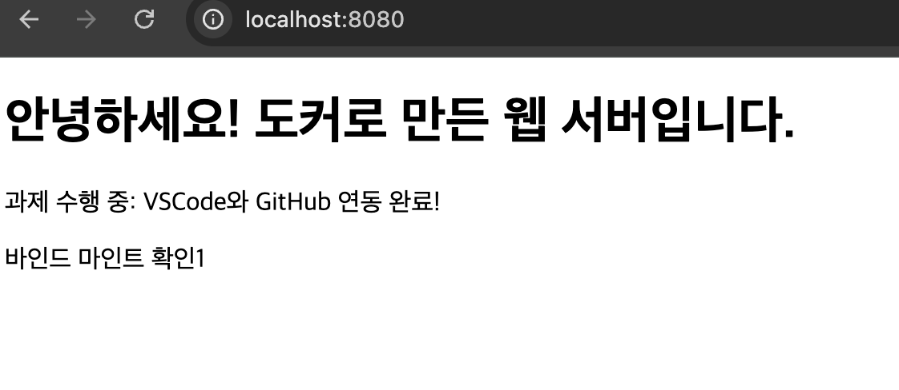
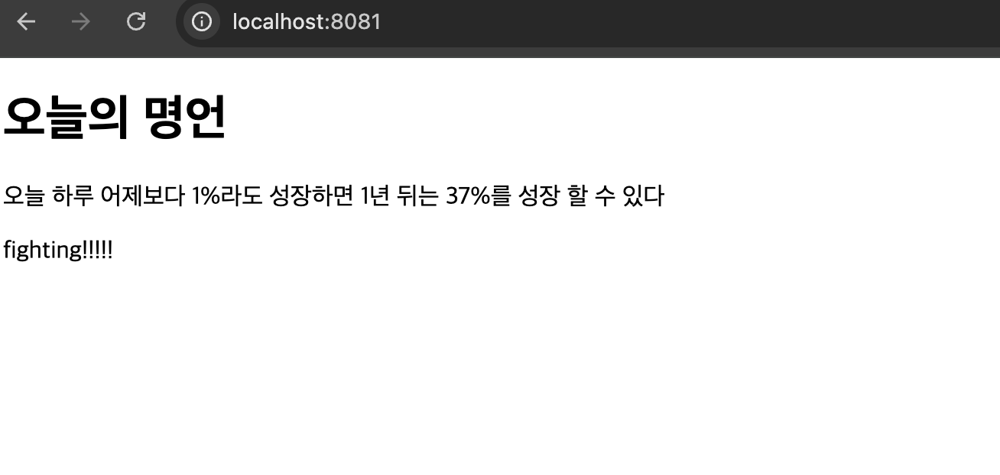

# 🐳 개발 워크스테이션 구축 실습 (Linux · Docker · Git)

## 📋 프로젝트 개요

리눅스 터미널 기본 조작, 파일 권한 관리, Docker 설치 및 기본 운영, 기존 Dockerfile 기반 커스텀 이미지 제작, 포트 매핑, 바인드 마운트, Docker 볼륨을 통한 데이터 영속성 검증, Git/GitHub 연동까지 개발 환경 구축에 필요한 핵심 요소를 직접 실습하고 그 과정을 문서화한 프로젝트이다.

이 과정을 통해 다음을 스스로 설명할 수 있는 것을 목표로 한다.

- 절대 경로와 상대 경로의 차이
- 파일 권한(r/w/x)의 의미와 `755`, `644` 같은 숫자 표기의 규칙
- 기존 Dockerfile을 기반으로 커스텀 이미지를 만드는 방법
- 포트 매핑이 필요한 이유
- Docker 볼륨(영속 데이터)의 동작 방식
- Git과 GitHub의 역할 차이(로컬 버전관리 vs 원격 협업 플랫폼)

## 💻 실행 환경

```text
OS       : macOS
Shell    : zsh
Docker   : Docker version 29.4.0, build 9d7ad9f (Docker Context: orbstack / OrbStack 사용)
Git      : git version 2.53.0
Kernel   : 24.6.0
```

## ✅ 수행 항목 체크리스트

| 항목 | 수행 여부 |
|---|---|
| 터미널 기본 명령어 실습 (경로 확인/이동/생성/복사/삭제) | ✅ |
| 파일·디렉토리 권한 실습 (`chmod`) | ✅ |
| Docker 설치 및 데몬 동작 점검 | ✅ |
| Docker 기본 운영 명령 (image/container/log/stats) | ✅ |
| 컨테이너 실행 실습 (`hello-world`, `ubuntu`) | ✅ |
| 컨테이너 종료/유지 방식 비교 (`exit` / `Ctrl+P,Q` / `exec`) | ✅ |
| 기존 Dockerfile(nginx) 기반 커스텀 이미지 제작 | ✅ |
| 포트 매핑 및 접속 검증 | ✅ |
| 바인드 마운트 vs 이미지 빌드 비교 관찰 | ✅ |
| Docker 볼륨 영속성 검증 | ✅ |
| Git 설정 및 GitHub 연동 | ✅ |
| 트러블슈팅 기록 (2건 이상) | ✅ |
| 보안/개인정보 마스킹 점검 | ✅ |

---

## Step 1. Git 설정 및 GitHub 연동

`git config --list` 결과로 사용자 정보 및 원격 저장소 연동 상태를 확인했다. (개인 식별 정보는 마스킹 처리)

```bash
git config --list
```

```text
credential.helper=osxkeychain
user.name="개인정보삭제"
user.email="개인정보삭제"
core.repositoryformatversion=0
core.filemode=true
core.bare=false
core.logallrefupdates=true
core.ignorecase=true
core.precomposeunicode=true
remote.origin.url=https:"개인정보삭제"
remote.origin.fetch=+refs/heads/*:refs/remotes/origin/*
branch.main.remote=origin
branch.main.merge=refs/heads/main
branch.main.vscode-merge-base=origin/main
```

**검증 방법**: `remote.origin.url`, `branch.main.remote`, `branch.main.merge` 값이 모두 정상적으로 설정되어 있는 것으로 GitHub 저장소와의 연동 및 `main` 브랜치 추적 설정이 완료되었음을 확인했다. 

---

## Step 2. 리눅스 터미널 및 권한 실습

### 2-1. 기본 명령어 실습

**현재 위치 확인**

```bash
pwd
```

```text
/Users/<user>
```

**파일 목록 확인 및 이동**

```bash
ls
```

```text
codyssey_E1-1	Desktop		Library		OrbStack
codyssey_E1-2	Documents	Movies		Pictures
codyssey_E1-3	Downloads	Music		Public
```

```bash
cd codyssey_E1-1
pwd
```

```text
/Users/<user>/codyssey_E1-1
```

**숨김 파일 포함 목록 확인**

```bash
ls -al
```

```text
total 24
drwxr-xr-x   7 roiker78137  roiker78137  224  7 30 10:08 .
drwxr-x---+ 24 roiker78137  roiker78137  768  7 30 15:54 ..
drwxr-xr-x  12 roiker78137  roiker78137  384  7 30 10:06 .git
drwxr-xr-x   9 roiker78137  roiker78137  288  7 30 15:22 codyssey_test
-rw-r--r--   1 roiker78137  roiker78137  237  7 30 10:06 Dockerfile
-rw-r--r--   1 roiker78137  roiker78137  260  7 30 10:06 index.html
-rw-r--r--   1 roiker78137  roiker78137  314  7 30 10:06 README.md
```

**디렉토리 생성 및 파일 생성/조회**

```bash
mkdir terminal_test
ls
```

```text
codyssey_test	Dockerfile	index.html	README.md	terminal_test
```

```bash
cd terminal_test
echo "테스트용" > test.txt
cat test.txt
```

```text
테스트용
```

**이동 및 이름 변경**

```bash
mv test.txt hello.txt
ls
```

```text
hello.txt
```

**파일 복사**

```bash
cp hello.txt test1.txt
cat test1.txt
```

```text
테스트용
```

**삭제**

```bash
rm test1.txt
ls
```

```text
hello.txt
```

### 2-2. 명령어 기능 정리

| 분류 | 명령어 | 설명 |
|---|---|---|
| 디렉토리 생성/이동 | `mkdir 폴더명` | 새 디렉토리 생성 |
| | `cd ..` | 상위 디렉토리로 이동 |
| | `cd 폴더명` | 하위 디렉토리로 이동 |
| | `cd ~` | 홈 디렉토리로 이동 |
| 파일/디렉토리 관리 | `mv 파일명 이동할위치/` | 이동 또는 이름 변경 |
| | `cp 원본파일 복사할파일` | 파일 복사 |
| 삭제 | `rm -rf 폴더명` | 폴더 안 내용을 포함하여 모두 삭제 |
| | `rm` | 파일과 디렉토리 모두 삭제 가능 |
| | `rmdir` | 빈 디렉토리만 삭제 가능(파일 삭제 불가) |

### 2-3. 권한 실습 (chmod)

**대상**: 파일 1개(`test1`), 디렉토리 1개(`test2`)

**생성 및 변경 전 확인**

```bash
touch test1
mkdir test2
ls -l
```

```text
-rw-r--r--  1 roiker78137  roiker78137    0  7 30 16:21 test1
drwxr-xr-x  2 roiker78137  roiker78137   64  7 30 16:21 test2
```

macOS 기본 권한은 파일 `644`, 디렉토리 `755`이다.

**권한 변경**

```bash
chmod 777 test1   # 소유자·그룹·기타 모두 읽기/쓰기/실행 가능하게 변경
chmod 700 test2   # 소유자만 읽기/쓰기/접근 가능하게 변경
```

**변경 후 확인**

```bash
ls -l
```

```text
-rwxrwxrwx  1 roiker78137  roiker78137    0  7 30 16:21 test1
drwx------  2 roiker78137  roiker78137   64  7 30 16:21 test2
```

**비교 요약**

| 대상 | 변경 전 | 변경 후 | 의미 |
|---|---|---|---|
| `test1` (파일) | `rw-r--r--` (644) | `rwxrwxrwx` (777) | 소유자·그룹·기타 모두 모든 권한 부여|
| `test2` (디렉토리) | `rwxr-xr-x` (755) | `rwx------` (700) | 소유자만 디렉토리 접근·탐색 가능 |

**권한 체계 참고**

| 숫자 | 권한 문자 | 의미 |
|---|---|---|
| 4 | r | 읽기 (Read) |
| 2 | w | 쓰기 (Write) |
| 1 | x | 실행 / 디렉토리 진입 (Execute) |

- `rwx` = 7(4+2+1): 읽기·쓰기·실행 모두 가능
- `rw-` = 6(4+2+0): 읽기·쓰기는 가능하나 실행 불가
- `r-x` = 5(4+0+1): 읽기·실행은 가능하나 수정 불가
- 디렉토리의 `x` 권한은 해당 디렉토리로 `cd` 진입할 수 있는 권한을 의미한다.
- `777`은 모두에게 모든 권한을 부여하므로 보안상 위험하다.
- 파일 권한은 `ls -l`, 디렉토리 자체의 권한은 `ls -ld`로 확인한다.

---

## Step 3. Docker 설치 및 기본 점검

```bash
docker --version
```

```text
Docker version 29.4.0
```

```bash
docker info
```

```text
Client:
 Version:    29.4.0
 Context:    orbstack
 Debug Mode: false
 Plugins:
  buildx: Docker Buildx (Docker Inc.)
    Version:  v0.33.0
    Path:     /Users/<user>/.docker/cli-plugins/docker-buildx
  compose: Docker Compose (Docker Inc.)
    Version:  v5.1.2
    Path:     /Users/<user>/.docker/cli-plugins/docker-compose

Server:
 Containers: 3
  Running: 3
  Paused: 0
  Stopped: 0
 Images: 5
 Server Version: 29.4.0
 Storage Driver: overlayfs
  driver-type: io.containerd.snapshotter.v1
 Logging Driver: json-file
 Cgroup Driver: cgroupfs
 Cgroup Version: 2
...(출력이 길어 이하 생략)
```

**검증 방법**: `docker --version`으로 클라이언트 버전을, `docker info`로 데몬(Server) 정상 동작 여부와 실행 중인 컨테이너/이미지 개수를 확인했다. OrbStack 컨텍스트에서 Docker 데몬이 정상 동작 중임을 확인했다.

---

## Step 4. Docker 기본 운영 명령 수행

**이미지 다운로드 및 목록 확인**

```bash
docker pull nginx
```

```text
Using default tag: latest
latest: Pulling from library/nginx
Digest: sha256:5a88c9c45479443d7be2eadc894b4ed0a9801bae03d97a5760ae13b5c2005942
Status: Image is up to date for nginx:latest
docker.io/library/nginx:latest
```

```bash
docker images
```

```text
IMAGE                 ID             DISK USAGE   CONTENT SIZE   EXTRA
my-custom-nginx:v1    2851f043293e       93.9MB         26.1MB
my-web-best:latest    09fde36a0971       93.9MB         26.1MB   U
my-web-final:latest   2d27fe862309       93.9MB         26.1MB   U
my-web:latest         329f7626e12a       93.9MB         26.1MB   U
nginx:latest          5a88c9c45479        240MB           66MB   U
```

**컨테이너 실행 상태 확인**

```bash
docker ps -a
```

```text
CONTAINER ID   IMAGE     COMMAND                   CREATED       STATUS                     PORTS                                     NAMES
ac7bf8188c92   my-web    "/docker-entrypoint.…"   6 hours ago   Up 6 hours                 0.0.0.0:8080->80/tcp, [::]:8080->80/tcp   web-container
71b98034b225   nginx     "/docker-entrypoint.…"   6 hours ago   Exited (0) (방금 전)                                                 web-container-2
```

**리소스 사용량 확인**

```bash
docker stats --no-stream web-container
```

```text
CONTAINER ID   NAME            CPU %     MEM USAGE / LIMIT     MEM %     NET I/O           BLOCK I/O         PIDS
ac7bf8188c92   web-container   0.00%     5.012MiB / 15.69GiB   0.03%     6.66kB / 3.08kB   11.3MB / 8.19kB   7
```

**로그 확인**

```bash
docker logs web-container
```

```text
/docker-entrypoint.sh: /docker-entrypoint.d/ is not empty, will attempt to perform configuration
/docker-entrypoint.sh: Looking for shell scripts in /docker-entrypoint.d/
/docker-entrypoint.sh: Launching /docker-entrypoint.d/10-listen-on-ipv6-by-default.sh
10-listen-on-ipv6-by-default.sh: info: Getting the checksum of /etc/nginx/conf.d/default.conf
10-listen-on-ipv6-by-default.sh: info: Enabled listen on IPv6 in /etc/nginx/conf.d/default.conf
/docker-entrypoint.sh: Sourcing /docker-entrypoint.d/15-local-resolvers.envsh
/docker-entrypoint.sh: Launching /docker-entrypoint.d/20-envsubst-on-templates.sh
/docker-entrypoint.sh: Launching /docker-entrypoint.d/30-tune-worker-processes.sh
```

---

## Step 5. 컨테이너 실행 실습

### 5-1. hello-world 실행

```bash
docker run hello-world
```

```text
Unable to find image 'hello-world:latest' locally
latest: Pulling from library/hello-world
4f55086f7dd0: Pull complete
d5e71e642bf5: Download complete
Status: Downloaded newer image for hello-world:latest

Hello from Docker!
This message shows that your installation appears to be working correctly.

To generate this message, Docker took the following steps:
 1. The Docker client contacted the Docker daemon.
 2. The Docker daemon pulled the "hello-world" image from the Docker Hub.
    (amd64)
 3. The Docker daemon created a new container from that image which runs the
    executable that produces the output you are currently reading.
 4. The Docker daemon streamed that output to the Docker client, which sent it
    to your terminal.
```

### 5-2. ubuntu 컨테이너 진입 및 명령 실행

```bash
docker run -it --name my-ubuntu ubuntu bash
```

```text
Unable to find image 'ubuntu:latest' locally
latest: Pulling from library/ubuntu
a3679419df18: Pull complete
ed819469700f: Pull complete
e16351a257e4: Download complete
Status: Downloaded newer image for ubuntu:latest
```

```bash
root@abfc7ff7d760:/# ls
```

```text
bin  boot  dev  etc  home  lib  lib64  media  mnt  opt  proc  root  run  sbin  srv  sys  tmp  usr  var
```

```bash
root@abfc7ff7d760:/# echo "fighting!"
```

```text
fighting!
```
```
% docker build -t e1-web:1.0 ./src
[+] Building 1.8s (7/7) FINISHED                                                                                          docker:orbstack
 => [internal] load build definition from Dockerfile                                                                                 0.2s
 => => transferring dockerfile: 170B                                                                                                 0.0s
 => [internal] load metadata for docker.io/library/nginx:alpine                                                                      0.0s
 => [internal] load .dockerignore                                                                                                    0.2s
 => => transferring context: 60B                                                                                                     0.0s
 => [internal] load build context                                                                                                    0.3s
 => => transferring context: 342B                                                                                                    0.0s
 => [1/2] FROM docker.io/library/nginx:alpine                                                                                        0.8s
 => [2/2] COPY index.html /usr/share/nginx/html/index.html                                                                           0.1s
 => exporting to image                                                                                                               0.2s
 => => exporting layers                                                                                                              0.1s
 => => writing image sha256:1c776491ab7860d7888c233c6264e1c71bc9bda8330ea55c7365448df29c3555                                         0.0s
 => => naming to docker.io/library/e1-web:1.0                                                                                        0.0s


% docker run -d --name e1-web e1-web:1.0
43cfb4b5aaa770602899a4dbaf807493e66142a046d07603948ee8c4bb61fb15

% docker ps --filter name=e1-web
CONTAINER ID   IMAGE        COMMAND                  CREATED          STATUS          PORTS     NAMES
43cfb4b5aaa7   e1-web:1.0   "/docker_test"   14 seconds ago   Up 13 seconds   80/tcp    test

% docker exec e1-web printenv APP_ENV
dev
```
### 5-3. 컨테이너 종료/유지 방식 비교

**① `exit` — 컨테이너 자체가 종료됨**

```bash
root@abfc7ff7d760:/# exit
```

```bash
docker ps -a
```

```text
CONTAINER ID   IMAGE         COMMAND      CREATED          STATUS                      NAMES
abfc7ff7d760   ubuntu        "bash"       6 minutes ago    Exited (0) 11 seconds ago   my-ubuntu
```

**② `Ctrl + P, Q` (detach) — 실행 상태가 유지된 채로 터미널에서만 빠져나옴**

```bash
docker ps
```

```text
CONTAINER ID   IMAGE     COMMAND      CREATED         STATUS          NAMES
abfc7ff7d760   ubuntu    "bash"       7 minutes ago   Up 43 seconds   my-ubuntu
```

**③ `docker exec`로 재진입 후 `exit` — 실행 상태 유지**

```bash
docker exec -it my-ubuntu bash
root@abfc7ff7d760:/# exit
docker ps
```

```text
CONTAINER ID   IMAGE     COMMAND      CREATED          STATUS          NAMES
abfc7ff7d760   ubuntu    "bash"       14 minutes ago   Up 7 minutes    my-ubuntu
```

**비교 요약**

| 방식 | 동작 | 결과 |
|---|---|---|
| `exit` (attach 상태에서) | 컨테이너의 메인 프로세스(쉘)를 종료 | 컨테이너 **정지(Exited)** |
| `Ctrl + P, Q` | 터미널 연결만 해제(detach), 프로세스는 유지 | 컨테이너 **계속 실행(Up)** |
| `docker exec`로 진입 후 `exit` | exec으로 연 별도 세션만 종료, 메인 프로세스는 그대로 유지 | 컨테이너 **계속 실행(Up)** |

즉 컨테이너를 정지시키는 것은 "터미널 연결 해제"가 아니라 **메인 프로세스(PID 1) 종료 여부**임을 확인했다. `exec`으로 진입한 세션은 메인 프로세스와 독립적이므로, 그 세션에서 `exit`해도 컨테이너 자체에는 영향이 없다.

---

## Step 6. 기존 Dockerfile 기반 커스텀 이미지 제작 및 포트 매핑

### 6-1. 선택한 베이스 이미지

- **선택 방식**: (A) 웹 서버 베이스 이미지 활용
- **베이스 이미지**: `nginx:alpine`
- **선택 이유**: 단순한 정적 웹페이지 서비스가 목적이므로, 무거운 OS 환경이 포함된 기본 `nginx` 이미지 대신 초경량 리눅스인 Alpine 기반의 `nginx:alpine`을 선택했다.

### 6-2. Dockerfile 및 커스텀 포인트

```dockerfile
# 가벼운 웹 서버 Nginx를 가져옵니다.
FROM nginx:alpine

# 방금 만든 HTML 파일을 도커 안의 웹 서버 폴더로 복사합니다.
COPY index.html /usr/share/nginx/html/index.html

# 웹 사이트에서 사용할 포트
EXPOSE 80
```

```html
<!DOCTYPE html>
<html>
<head>
    <meta charset="UTF-8">
    <title>나의 도커 웹서버</title>
</head>
<body>
    <h1>오늘의 명언</h1>
    <p>오늘 하루 어제보다 1%라도 성장하면 1년 뒤는 37%를 성장 할 수 있다</p>
    <p>fighting!!!!!</p>
</body>
</html>
```

**커스텀 포인트 목적**

| 커스텀 포인트 | 목적 |
|---|---|
| `COPY index.html ...` | 기본 nginx 웰컴 페이지 대신 직접 제작한 페이지를 띄우기 위함 |
| `EXPOSE 80` | 컨테이너가 사용하는 포트를 명시하여, 다른 사람이 이미지 사용 시 포트를 쉽게 파악할 수 있도록 함 |

### 6-3. 빌드 및 실행 결과

이미지(`my-web`)가 정상적으로 생성되어 컨테이너가 문제없이 기동되었음을 `docker ps -a`로 확인했다. (별도의 `docker build` 출력 로그는 보존해두지 않았다.)

```bash
docker run -d --name web-container -p 8080:80 my-web
```

```text
d7ba13e8837825034c198ff68bae4c130999b20cc257e472dda7964d99ac28e0
```

```bash
docker ps -a
```

```text
CONTAINER ID   IMAGE     COMMAND                   CREATED         STATUS         PORTS                                      NAMES
98f8aa8e2a2a   nginx     "/docker-entrypoint.…"   4 minutes ago   Up 4 minutes   0.0.0.0:8081->80/tcp, [::]:8081->80/tcp   my-wed-mount
ac7bf8188c92   my-web    "/docker-entrypoint.…"   7 hours ago     Up 7 hours     0.0.0.0:8080->80/tcp, [::]:8080->80/tcp   web-container
```

### 6-4. 포트 매핑 접속 증거

`-p 8080:80` 옵션으로 호스트 8080 포트를 컨테이너 80 포트에 매핑하여 브라우저 및 `curl`로 접속을 검증했다.

> 📸  브라우저에서 `http://localhost:8080` 접속 시 커스텀 페이지("오늘의 명언")가 정상 출력되는 화면 (스크린샷 첨부 위치)

### 6-5. 바인드 마운트 vs 빌드 이미지 비교 관찰

빌드된 이미지 컨테이너(`web-container`, 8080번 포트)와 별도로, 동일한 `index.html`을 **바인드 마운트**로 연결한 컨테이너(`my-wed-mount`, 8081번 포트)를 함께 띄워 두 방식의 차이를 비교 관찰했다.

**관찰 결과**


- 바인드 마운트(8081)를 적용한 경우: 호스트의 `index.html`을 수정하고 새로고침하면 **즉각적으로 변경 사항이 반영**되었다.
- 이미지 빌드(8080)만 적용한 경우: 파일을 수정해도 반영되지 않으며, 새 이미지를 다시 `build` → 컨테이너를 재실행 → 새로고침해야 변경 사항이 반영되었다.

**결론**: 바인드 마운트는 개발 중 실시간으로 코드/콘텐츠를 반영해야 할 때 유용하고, 이미지 빌드는 새로운 버전을 고정하여 배포할 때 적합하다는 것을 실습을 통해 확인했다.

---

## Step 7. Docker 볼륨 영속성 검증

**볼륨을 연결한 컨테이너 생성 및 접속**

```bash
docker run -it --name c1 -v v1:/data ubuntu bash
```

**컨테이너 안에서 파일 생성 및 확인**

```bash
echo "fighting!" > /data/volume.txt
cat /data/volume.txt
```

```text
fighting!
```

**컨테이너에서 빠져나오기**

```bash
exit
```

**컨테이너 삭제**

```bash
docker rm c1
```

```text
c1
```

**새 컨테이너로 동일 볼륨 연결 및 데이터 확인**

```bash
docker run --name c2 -v v1:/data ubuntu cat /data/volume.txt
```

```text
fighting!
```

**결론**: 컨테이너(`c1`)를 삭제한 뒤에도 동일한 볼륨(`v1`)을 새 컨테이너(`c2`)에 연결하면 이전에 작성한 `volume.txt` 내용(`fighting!`)이 그대로 유지되는 것을 확인했다. → **Docker 볼륨은 컨테이너의 생명주기와 독립적으로 데이터를 영속 보관한다.**

---

## Step 8. 트러블슈팅

### 트러블슈팅 1. GitHub Push 거부 오류 (원격 저장소와 로컬 저장소의 동기화 충돌)

**문제 상황**

로컬에서 작업한 내용을 `git push` 하려고 했으나 아래와 같이 업로드가 거부되었다.

```text
[rejected] main -> main (fetch first)
```

**원인 가설**

GitHub 웹사이트에서 직접 `README.md`를 수정하거나 파일을 생성한 적이 있어, GitHub에는 있지만 로컬 PC에는 없는 커밋이 존재했을 것으로 추정했다. 이로 인해 두 저장소의 히스토리가 일치하지 않아 충돌이 발생했다고 판단했다.

**확인**

GitHub 저장소 페이지에 접속하여 확인한 결과, GitHub와 VSCode(로컬)에 저장된 폴더·파일 구성이 서로 다르다는 것을 확인했다.

**해결**

```bash
git pull origin main
git push
```

`git pull origin main`으로 원격의 변경 사항을 먼저 가져온 뒤 다시 `git push`를 시도했지만 여전히 해결되지 않았다. GitHub 쪽의 중요한 내용을 별도로 백업해 둔 뒤, 아래 명령으로 강제로 덮어써 해결했다.

```bash
git push -f
```

**대안 / 배운 점**

협업 시에는 작업을 시작하기 전 항상 `git pull`을 습관화하여 로컬과 원격의 싱크를 맞추어야 한다. 부득이하게 강제로 덮어써야 하는 상황이라면 `git push -f`를 사용할 수 있지만, 원격의 변경 내용을 덮어쓰는 만큼 주의가 필요하다는 것을 학습했다.

### 트러블슈팅 2. 컨테이너 생명주기 관리와 대화형 모드의 상관관계

**문제 상황**

개발 환경 구축을 위해 `docker run -it ubuntu bash` 명령으로 컨테이너에 접속하여 각종 패키지를 설치하고 환경 설정을 진행했다. 작업을 마치고 컨테이너 내부에서 `exit`을 입력해 터미널을 빠져나오자, 실행 중이던 컨테이너가 즉시 `Exited` 상태로 바뀌며 중지되었다. 다시 접속하려면 매번 `start`와 `attach`를 반복해야 하는 번거로움이 발생했다.

**원인 가설**

컨테이너에 들어갔다가 나가면 원래 컨테이너 자체도 함께 종료되는 것이 아닌가 추정했고, 이를 보완할 방법이 있을 것이라 가정했다.

**확인**

- `docker ps -a`로 확인한 결과, `exit` 직후 컨테이너가 `Exited` 상태임을 확인했다.
- 이미 실행 중인 다른 컨테이너(nginx 등)에 `docker exec -it`로 접속한 뒤 `exit`을 시도한 경우에는 컨테이너가 죽지 않고 계속 실행되는 것을 확인했다.
- `Ctrl + P, Q`로 빠져나왔을 때도 컨테이너가 죽지 않고 계속 실행되는 것을 확인했다.

**해결**

```bash
# 컨테이너를 백그라운드(detached)로 실행
docker run -d --name my-dev ubuntu tail -f /dev/null

# 이미 실행 중인 컨테이너에 접속
docker exec -it my-dev bash
```

컨테이너를 처음 띄울 때 `-d` 옵션으로 백그라운드에서 영구적으로 동작하도록 설정하고, 이미 돌아가고 있는 컨테이너에는 `docker exec -it my-dev bash`로 접속하는 방식으로 전환했다. 이렇게 하면 `exec`로 들어간 터미널에서 `exit`을 하더라도 컨테이너의 메인 프로세스는 그대로 살아있으므로 컨테이너가 중지되지 않는다.

**대안 / 배운 점**

이번 문제를 겪으면서 **"코드가 정상적이라면, 의심의 화살을 실행 환경으로 돌려야 한다"**는 소중한 교훈을 얻었다. 처음에는 코드 내부의 논리적 오류나 문법 문제일 것이라 맹신하고 수없이 코드를 수정해 보았지만, 실제 원인은 엉뚱하게도 파일을 실행하는 **'현재 작업 위치(경로)'**라는 아주 기초적인 환경적 요인이었다. 이 과정에서 문제의 본질을 놓친 채 엉뚱한 곳을 헤매며 시간을 쏟는 것이 얼마나 비효율적인지 뼈저리게 느꼈다.

앞으로 개발을 할 때는 복잡한 코드 수정에만 매몰되지 않고, `pwd` 명령어로 현재 내 위치를 먼저 확인하는 것처럼 실행 맥락과 환경을 가장 먼저 점검하는 기본기를 잊지 말아야겠다고 다짐했다. 눈앞의 에러에 당황하기보다 시야를 넓혀 전체적인 시스템 환경을 바라보는 개발자의 안목을 기르는 좋은 계기가 되었다.

---

## Step 9. 보안 및 개인정보 점검

- [x] 모든 명령어와 출력 결과를 ` ```bash ` / ` ```text ` 코드 블록으로 정리함
- [x] `git config --list` 결과 중 `user.name`, `user.email`은 마스킹 처리함
- [x] 터미널 로그 내 홈 경로의 사용자명은 `<user>`로 마스킹함
- [x] 문서 전체에 토큰, 비밀번호, 개인키, 인증 코드 등 민감 정보는 포함되지 않음을 확인함

---

## 📎 실행 방법 참고

```bash
git clone https://github.com/roiker7/codyssey_test.git
cd codyssey_test
docker build -t my-web .
docker run -d --name web-container -p 8080:80 my-web
```

접속 확인:

```bash
curl http://localhost:8080
```

---

> 본 문서에 기록된 모든 명령어와 출력 결과는 실제 실습 과정에서 수행하고 기록한 내용을 기반으로 작성되었다. 다만 GitHub 연동 화면, 포트 매핑 접속 화면 등 일부 스크린샷은 첨부 위치만 표시해두었으므로, 실제 제출 시 해당 위치에 스크린샷 파일을 추가해야 한다.
