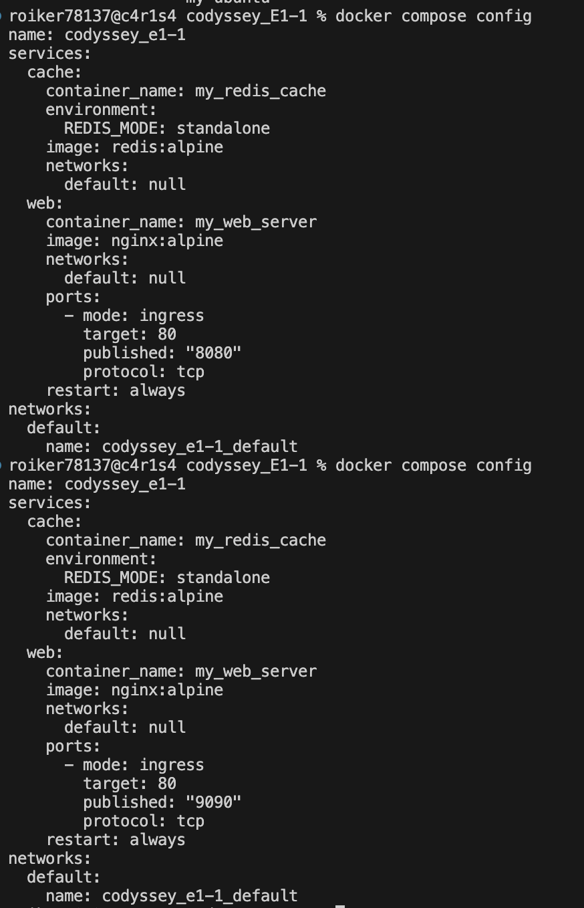

# 🐳 Docker Compose 및 GitHub SSH 설정 실습 
---
 
# Docker Compose 기초
docker-compose.yml의 기본 구조를 학습하고, 단일 서비스를 Compose로 실행한다.
```
services:
  web:
    image: nginx:alpine
    container_name: my_web_server
    ports:
      - "8080:80"
    restart: always

  cache:
    image: redis:alpine
    container_name: my_redis_cache
    ports:
      - "6379:6379"
    restart: always
```
### 배움 포인트: 컨테이너 실행 명령이 “문서화된 실행 설정”으로 바뀌는 이유
Docker Compose는 복잡한 docker run 명령어를 반복하는 대신, 설정 파일(compose.yaml)을 통해 컨테이너 실행 환경을 명확히 기록하고 공유하는 문서화된 실행 설정 역할을 합니다.

- 재현성: 팀원 누구나 동일한 환경을 오류 없이 쉽게 재현 가능
- 공유성: 실행 방법이 파일 자체로 기록되어 협업 시 전달이 명확함
- 관리 편의성: 긴 명령어를 매번 입력할 필요 없이 효율적으로 관리 가능

---

# Docker Compose 멀티 컨테이너
- 웹 서버 + (임의의 보조 서비스) 2개 이상을 Compose로 함께 실행한다.
```
services:
  web:
    image: nginx:alpine
    container_name: my_web_server
    ports:
      - "8080:80"

  cache:
    image: redis:alpine
    container_name: my_redis_cache

  db:
    image: postgres:15-alpine
    container_name: my_db_server
    environment:
      POSTGRES_PASSWORD: mypassword
```
- 컨테이너 간 네트워크 통신이 가능한지 확인한다.
```
% docker compose exec web nslookup cache
% docker compose exec web nslookup db
Server:         127.0.0.11
Address:        127.0.0.11:53

Non-authoritative answer:
Name:   cache
Address: 192.168.97.3

Non-authoritative answer:

Server:         127.0.0.11
Address:        127.0.0.11:53

Non-authoritative answer:
Name:   db
Address: 192.168.97.4
```
### 배움 포인트: 네트워크/서비스 디스커버리 개념 맛보기

핵심 요약
Docker Compose는 실행된 컨테이너들을 자동으로 동일한 네트워크에 묶어주며, IP 주소나 localhost 대신 서비스 이름(예: db)을 사용하여 서로를 찾고 통신할 수 있는 서비스 디스커버리 기능을 제공합니다.

핵심 내용
네트워크: 컨테이너들이 서로 통신할 수 있는 공통 공간을 자동으로 형성
서비스 디스커버리: 복잡한 IP 주소 대신 이름만으로 서비스를 찾아 연결해 주는 기능
통신 방식: localhost 대신 서비스 이름을 사용하여 데이터베이스 등에 접속(localhost는 자기 자신으로 인식하여 접속 실폐할 가능성)


```
컨테이너끼리 통신: 같은 네트워크 안에서는 포트 설정없이도 이름으로 통신가능  
services:
  app:
    build: .
    depends_on:
      - db

  db:
    image: mysql:8
```
위 설정에서 app 컨테이너는 db 라는 이름으로 MySQL 컨테이너를 찾을 수 있다. 그래서 애플리케이션 DB 주소를 db로 설정하면 된다

---

# Compose 운영 명령어 습득
| 명령어 | 설명 | 주요 옵션 및 사용 예시 |
| --- | --- | --- |
| docker compose up | docker-compose.yml 에 정의된 모든 서비스 컨테이너를 생성하고 실행합니다. | -d: 백그라운드에서 실행<br>
<br>
<br>docker compose up -d |
| docker compose ps | 현재 실행 중인 멀티 컨테이너들의 상태, 포트 매핑 등을 조회합니다. | 기본 형태<br>
<br>
<br>docker compose ps |
| docker compose logs | 컨테이너 내부의 시스템 로그를 확인하여 에러 디버깅 등에 활용합니다. | -f: 실시간 로그 추적<br>
<br>
<br>docker compose logs -f |
| docker compose down | 실행 중인 모든 컨테이너를 중지하고 삭제하며, 내부 네트워크까지 깔끔하게 정리합니다. | -v: 데이터 볼륨까지 함께 삭제<br>
<br>

### 배움 포인트: 운영 관점의 “상태 확인 루틴” 만들기
```
docker compose up -d   # 실행
docker compose ps      # 상태 확인
docker compose logs -f # 로그 확인
docker compose down    # 종료/정리
```
로틴은 켜기 → 상태 보기 → 로그 보기 → 끄기
즉, 단순히 실행만 하는 게 아니라 ps로 정상인지 확인하고, 문제가 있으면 logs로 원인을 찾는 습관을 만드는 것이 배움 포인트입니다.

---

# 환경 변수 활용
- Dockerfile 또는 Compose에서 환경 변수를 주입해 서버 포트/모드를 바꿔본다.
```
services:
  web:
    image: nginx:alpine
    ports:
      - "${WEB_PORT:-8080}:80"
```
```.env
WEB_PORT=8080 #만약 포트를 바꾸고 싶다면 .env만 수정하면 된다
```
```
% docker compose up -d
Found orphan containers ([my_db_server]) for this project. If you removed or renamed this service in your compose file, you can run this command with the --remove-orphans flag to clean it up. 
[+] up 2/2
 ✔ Container my_web_server  Started                                                                                         1.2s
 ✔ Container my_redis_cache Started 
```
```
 docker compose config
```

- 배움 포인트: 설정과 코드의 분리
핵심 요약
데이터베이스 비밀번호, 포트 번호, API 키 같은 설정값을 코드에 직접 고정하지 않고 환경 변수로 분리하여, 코드 수정 없이 실행 환경에 따라 설정만 유연하게 바꿀 수 있도록 하는 관리 방식입니다.

핵심 내용
설정 분리: 민감하거나 환경에 따라 달라지는 값을 코드에서 분리
관리 방식: .env 파일이나 Compose의 environment 설정 활용
유연성: 동일한 코드를 유지하면서 실행 환경별 설정 변경 가능

---

# GitHub SSH 키 설정
- HTTPS 대신 SSH로 푸시가 가능하도록 키를 등록하고 동작을 확인한다.
```
% ssh-keygen -t rsa -b 4096 -C "<email>@example.com"
Generating public/private rsa key pair.
```

### 배움 포인트: 인증 방식 차이와 보안 습관
| 구분 | HTTPS | SSH |
| --- | --- | --- |
| 주소 형태 | https://github.com/.. | git@github.com:..|
| 인증 수단 | GitHub 토큰 | SSH 키 |
| 초기 설정 | 쉬움 | 약간 복잡 |
| 반복 사용 | 토큰 입력/저장 필요 | 한 번 설정 후 편리 |
| 보안 핵심 | 토큰 관리 | 개인 키 관리 |
| 주 사용 상황 | 간단한 clone, 초보자 | 개발자 로컬 환경, 배포 서버 |

요약: 간단히 쓰려면 HTTPS, 장기적으로 개발 환경을 편하게 쓰려면 SSH가 좋습니다.
